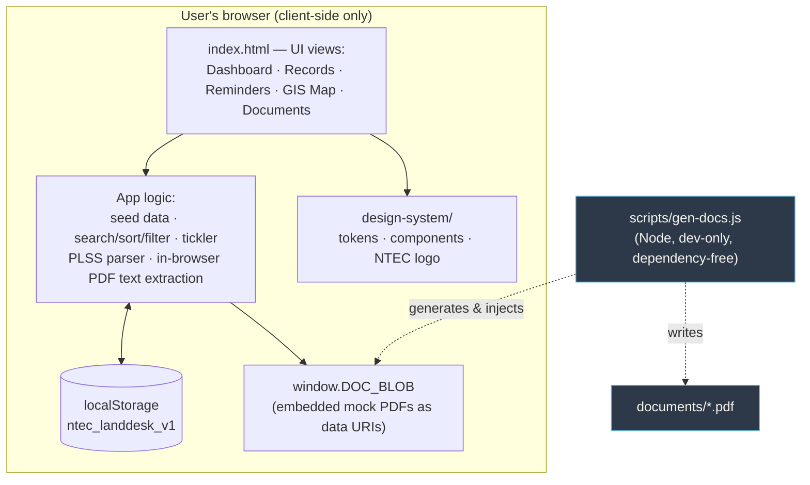

# NTEC LandDesk — Architecture

**Status:** Prototype · **Data tier (prototype):** Tier 2 (Internal, illustrative data)

## Summary

LandDesk is a **single-page, client-side application**. All logic, styles, and
seed data live in `index.html`; the app runs entirely in the browser with no
server, no build step, and no runtime network calls. State persists in the
browser's `localStorage` under the key `ntec_landdesk_v1`. Brand assets come
from the vendored `design-system/`. Mock PDF instruments are produced offline by
`scripts/gen-docs.js` and embedded into `index.html` as data URIs.

## Component diagram

> No backend, API, database, authentication, or AI service is involved at
> runtime. PDF auto-fill on intake parses text locally in the browser — nothing
> is uploaded.

## Key modules (all within `index.html`)

| Concern | What it does |
|---|---|
| Seed & state | Seeds illustrative records; reads/writes `localStorage`. |
| Records | Global search, per-column sort, type/status filters, detail drawer, edit/delete. |
| Tickler | Buckets obligations into Overdue / Due ≤ 30 days / Upcoming against a fixed demo date (2026-08-03). |
| GIS / PLSS | Parses legal descriptions (`T29N R16W Sec 4–9…`) into township + section lists and renders a 6×6 section grid. |
| Documents | In-app PDF viewer over embedded data URIs; drag-and-drop intake. |
| PDF auto-fill | In-browser text extraction (uncompressed + FlateDecode via `DecompressionStream`); heuristic field mapping into the intake form. |
| Theme | NTEC design tokens (dark theme) sourced from `design-system/`. |

## Notable technical decisions

See [Architecture Decision Records](./decisions/). The defining decision — a
single self-contained HTML file with no backend — is recorded in
[ADR-001](./decisions/ADR-001-single-file-prototype.md).

## Path to production

A production build would introduce a backend + PostgreSQL (with committed
migrations, audit trail, and real document storage), NTEC Entra ID
authentication, a TypeScript/ESLint/Prettier + test-first codebase, a CI/CD
pipeline with a secret-scan gate, and structured (Pino) logging — and must clear
ARB review before handling real (Tier 3) land and tribal-government data. See
the README "Path to production" section.
